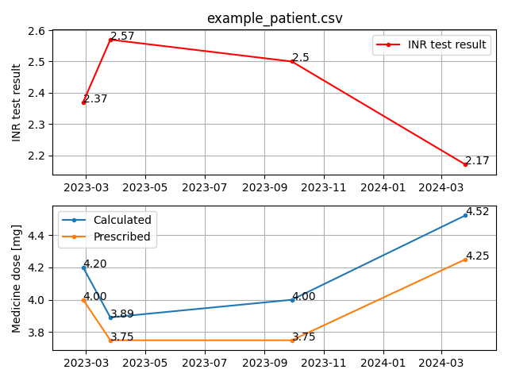

## INResolver

**_Algorithm for setting proper quantity of anti-clotting medicine_**

Script takes patient's data (INR test result, weight, diet circumstances, other medicines taken, age, sex)
in CSV format and tries to return the proper quantity of acenocoumarol or warfarin medicine.

### Structure of CSV (comma-separated values) file with patient's data:
date (yyyy-mm-dd),\
INR test result (for example 2.37),\
weight in kilograms (for example 61.2),\
diet circumstances (by putting a proper letter from a dictionary below, if not applicable leave it blank),\
other medicines taken (by putting a proper letter from a dictionary below, if not applicable leave it blank),\
age in years (for example 42.7),\
sex (M/F),

#### Diet circumstances dictionary 
_Uppercase or lowercase letters cannot repeat in one dictionary_
###### Increasing INR
A - Alcohol\
O - Other
###### Decreasing INR
V - vegetables rich in vitamin K\
O - Other

#### Other medicines taken dictionary
_Uppercase or lowercase letters cannot repeat in one dictionary_
###### Increasing INR
A - Antibiotics\
H - Heparin\
S - Salicylic acid (Aspirin)\
O - Other
###### Decreasing INR
e - example\
O - Other
