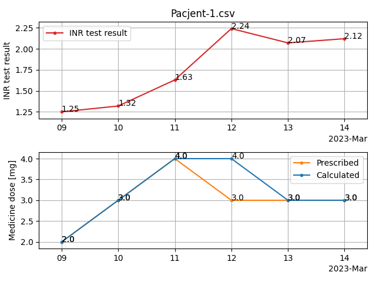

## INResolver

**_Algorithm for setting proper quantity of VKA_**

Script takes patient's data (INR test result, other medicines taken, ALT, AST, GGTP test results,
prescribed dose, type of medicine, birthdate, sex)
in CSV format and tries to return the proper quantity of acenocoumarol or warfarin medicine.

### Structure of CSV (comma-separated values) file with patient's data:
date (dd.mm.yyyy);\
INR test result (for example 2.37);\
other medicines taken (by putting a proper letter from a dictionary below, if not applicable leave it blank);\
diet circumstances (by putting a proper letter from a dictionary below, if not applicable leave it blank);\
ALT test result (for example 15, non-mandatory);\
AST test result (for example 20, non-mandatory;\
GGTP test result (for example 16, non-mandatory);\
prescribed dose of medicine in mg (for example 4.5);\
medicine type (A/W);\
birthdate (dd.mm.yyyy, taken from first row);\
sex (M/F, taken from first row)

#### Diet circumstances dictionary 
_Uppercase or lowercase letters cannot repeat in one dictionary_
###### Increasing INR
A - Alcohol\
O - Other
###### Decreasing INR
V - vegetables rich in vitamin K\
O - Other

#### Other medicines taken dictionary
_Uppercase or lowercase letters cannot repeat in one dictionary_
###### Increasing INR
A - Antibiotics\
H - Heparin\
S - Salicylic acid (Aspirin)\
O - Other
###### Decreasing INR
e - example\
O - Other
